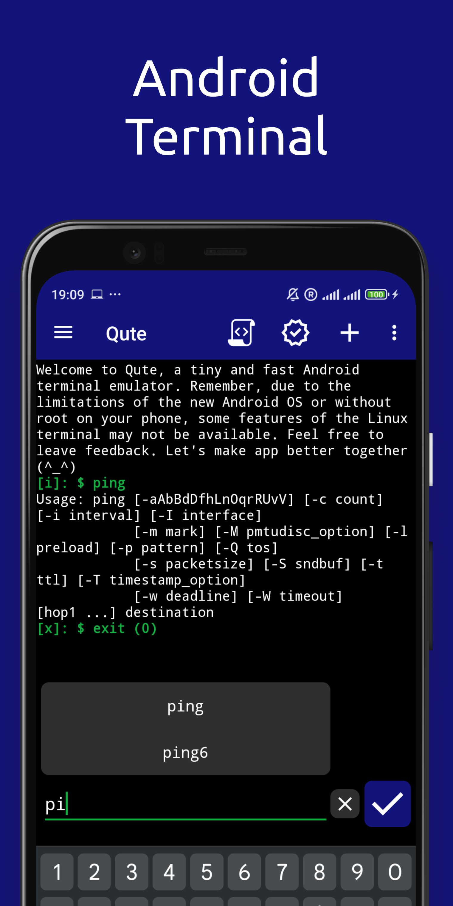
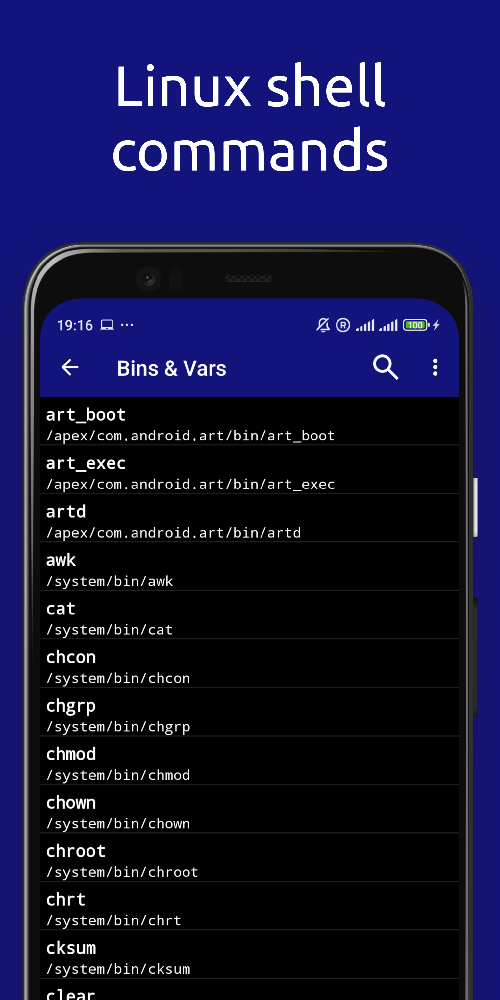
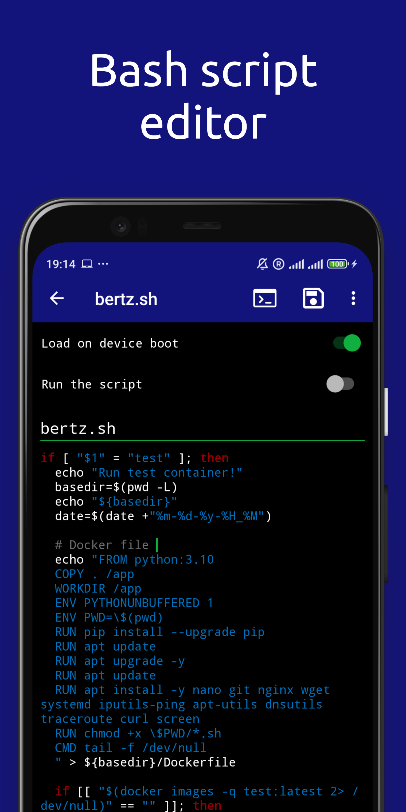
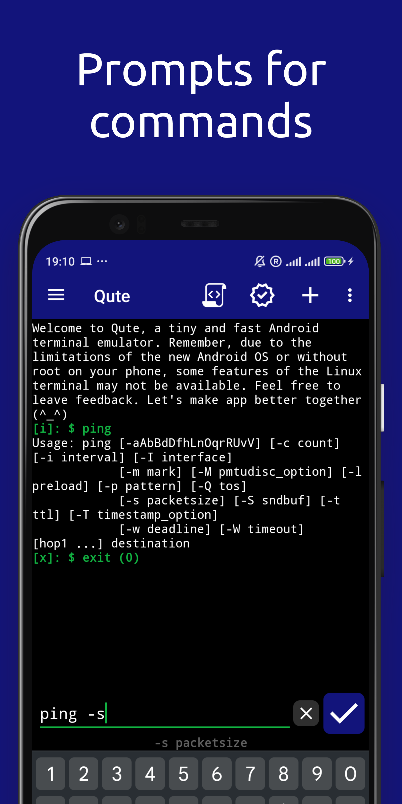

# Qute Terminal Emulator
 

Terminal emulator - used to emulate a unix terminal and work on the command line on your smartphone.

Download Qute apk

**NOTICE: We strongly recommend getting the app from Google Play. Please note that if you are using an apk file from this repository, you will need to first delete the original application downloaded through Google Play, because it is signed by Google.** 

## Features
* Autorun and creation of shortcuts
* Bash script editor
* Command line file manager
* Run bin files in terminal, when available
* Manage files with nnn and edit them with nano, vim, or emacs
* Access to servers via ssh
* Bash and ssh shell
* Create your own list of teams
* Automatic completion
* Support for rooted devices

## Screenshots
<table>
  <tr>
    <td></td>
    <td></td>
    <td></td>
    <td></td>
	</tr>
</table>
  
## Compatibility
Latest version supports Android 8.0+ (Android APi 26+) and [legacy](https://github.com/BlindZoneApps/qute-apk/releases/tag/3.111) version for Android 5.0+ (Android API 21+). All architectures.

## EULA & Privacy Policy
By downloading or opening the application, you accept the [user agreement and privacy policy](https://blindzone.org/eula). 
You may not: copy, modify, translate or create derivative works based on the  Qute ("Software"); distribute, transfer, publish, disclose, sublicense, lease, lend, sell or rent the Software to any third party; reverse engineer, decompile, reverse decompile or disassemble the Software, or otherwise attempt to derive the source code; make the functionality of the Software available to third parties or multiple users through any means, or benchmark or conduct any performance or comparison tests on the Software. BlindZone LLC reserves all rights in and to the Software not expressly granted to you under EULA.
